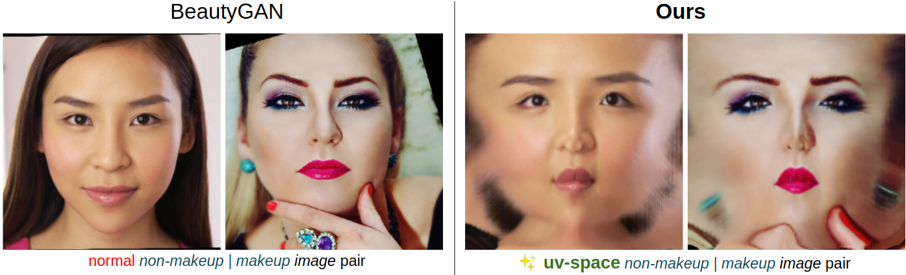
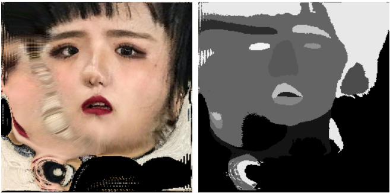

# Color Makeup - Training Guideline

|  | 
|:--:| 
| This is a training guideline for Color Branch (C), one out of two branches in [Color-Pattern Makeup Transfer (CPM)](../README.md).|

---

For Color Branch, we used the same CycleGAN-based model like [BeautyGAN](liusi-group.com/pdf/BeautyGAN-camera-ready_2.pdf).
But instead of normal training pair, we used our **novel UV-space**.

1. **Download [Makeup Transfer Dataset](http://liusi-group.com/projects/BeautyGAN)** & unzip it. The dataset folder should be like:

	```
	all
	|__ images
		|__ makeup
		|__ non-makeup
	|__ segs
		|__ makeup
		|__ non-makeup
	```

2. **Get UV texture**: Use [PRNet](https://github.com/YadiraF/PRNet) to get respective uv-map texture of each image and its segmentation mask


```
python create_beautygan_uv.py --path /path/to/makeup_transfer_dataset --savedir /path/to/save_folder
```

Result will be saved in `--savedir` folder. You should find image pair like this:

|  | 
|:--:| 
| From left to right: Segmentation Mask, UV-texture.|

3. **Train Color Branch**: Follow instruction at [BeautyGAN-pytorch-reimplementation](https://github.com/thaoshibe/BeautyGAN-PyTorch-reimplementation) or [BeautyGAN-pytorch-implementation](https://github.com/wtjiang98/BeautyGAN_pytorch) to re-train model with newly established dataset.