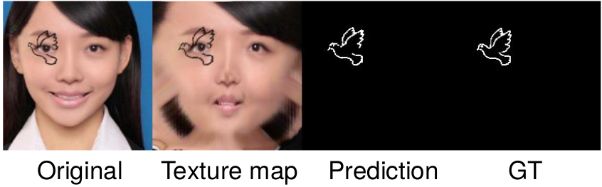

# Pattern Makeup - Training Guideline

|  | 
|:--:| 
| Color Makeup |

This is training guideline for Color Branch (P), one out of two branches in [Color-Pattern Makeup Transfer (CPM)](../README.md).

---

1. **Requirements**: Please refer to [Getting Started/ Requirements](../README.md), the main components are:
	- torch >=1.6
1. **Data Preparation**: Please download [CPM-Synt-1](../readme-about-data.md)
1. **Training**: `python train.py --datapath /pathtodata`
1. (Optional):
	- Open Tensorboard: `tensorboard --logdir=runs`

### Acknowledgements

This code is heavily based on [wtjiang98 - BeautyGAN_pytorch](https://github.com/wtjiang98/BeautyGAN_pytorch) and [YadiraF - PRNet](https://github.com/YadiraF/PRNet)