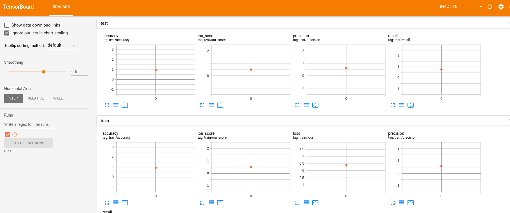

# Pattern Makeup - Training Guideline

|  | 
|:--:| 
| This is a training guideline for Pattern Branch (P), one out of two branches in [Color-Pattern Makeup Transfer (CPM)](../README.md)|

---

1. **Requirements**: Please refer to [Getting Started/ Requirements](../README.md), the main components are:
	- [segmentation_models.pytorch](https://github.com/qubvel/segmentation_models.pytorch)
	- torch >=1.6
1. **Data Preparation**: Please download CPM-Synt-1 in [here](https://public.vinai.io/CPM-datasets/CPM-Synt-1.zip), or via wget:
	```
	wget https://public.vinai.io/CPM-datasets/CPM-Synt-1.zip
	unzip CPM-Synt-1.zip
	```
1. **Training/ Evaluation**: `python train.py --datapath /pathtodata`. Test result should be found in Tensorboard.
1. (Optional):
	- Open Tensorboard: `tensorboard --logdir=runs`
	- Change backbones, pretrained_weights: Check `parser.py`

|  | 
|:--:| 
| Snapshot of Tensorboard at epoch 1. Evaluation metrics on test set should be found (Accuracy, Recall, Precision, etc.) |


##### Acknowledgements

This code is based on [PRNet](https://github.com/YadiraF/PRNet) and [segmentation_models.pytorch](https://github.com/qubvel/segmentation_models.pytorch)