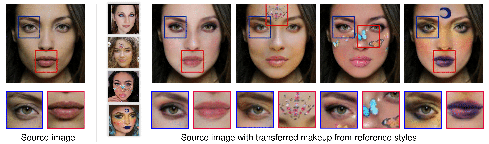
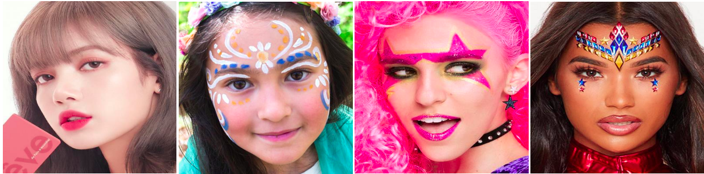
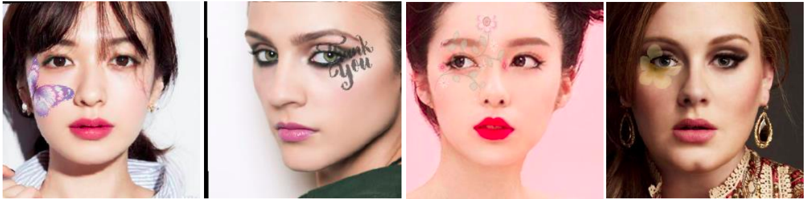
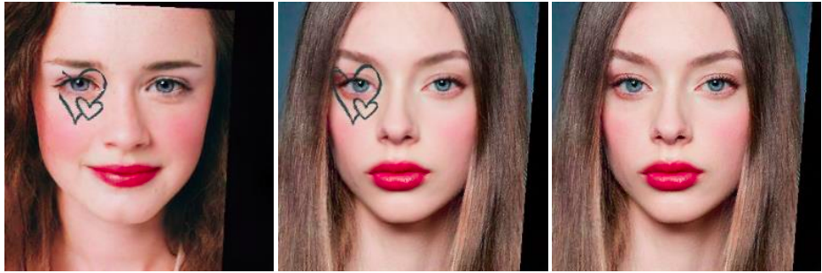
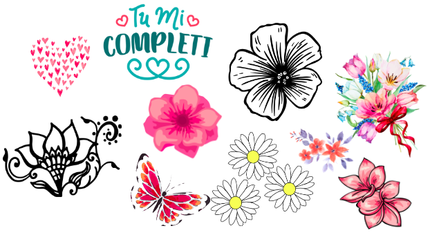
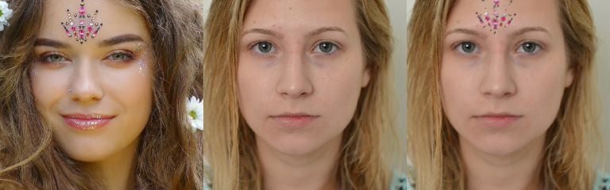

##### Table of Content

1. [Introduction](#cpm-color-pattern-makeup-transfer)
1. [Datasets](#datasets)
1. [Getting Started](#getting-started)
	- [Requirements](#requirements)
	- [Usage Example](#usage)
1. [Training & Evaluation](#training-and-evaluation)

# CPM: Color-Pattern Makeup Transfer

- CPM is a holistic makeup transfer framework that outperforms previous state-of-the-art models on both light and extreme makeup styles.
- CPM consists of an improved color transfer branch (based on [BeautyGAN](http://www.colalab.org/projects/BeautyGAN)) and a novel pattern transfer branch.
- We also introduce 4 new datasets (both real and synthesis) to train and evaluate CPM.

📢 **New**: We provide [❝Qualitative Performane Comparisons❞](https://thaoshibe.github.io/CPM#qualitative-result) online! Check it out!
|  |
|:--:|
| *CPM can replicate **both colors and patterns** from a reference makeup style to another image.*|

Details of the dataset construction, model architecture, and experimental results can be found in [our following paper](https://arxiv.org/abs/2104.01867):

```
@inproceedings{m_Nguyen-etal-CVPR21,
  author = {Thao Nguyen and Anh Tran and Minh Hoai},
  title = {Lipstick ain't enough: Beyond Color Matching for In-the-Wild Makeup Transfer},
  year = {2021},
  booktitle = {Proceedings of the {IEEE} Conference on Computer Vision and Pattern Recognition (CVPR)}
}
```
**Please CITE** our paper whenever our datasets or model implementation is used to help produce published results or incorporated into other software.

[](https://colab.research.google.com/drive/1K9QVSHPJ8fx9X8yg6KnhE40PPlyW5iNp?usp=sharing) - [](https://arxiv.org/abs/2104.01867) - [](https://thaoshibe.github.io/CPM)

---

### Datasets

We introduce ✨ 4 new datasets: **CPM-Real**, **CPM-Synt-1**, **CPM-Synt-2**, and **Stickers** datasets. Besides, we also use published [LADN's Dataset](https://georgegu1997.github.io/LADN-project-page/) & [Makeup Transfer Dataset](http://liusi-group.com/projects/BeautyGAN).

CPM-Real and Stickers are crawled from Google Image Search, while CPM-Synt-1 & 2 are built on [Makeup Transfer](http://liusi-group.com/projects/BeautyGAN) and Stickers. *(Click on dataset name to download)*

|    Name  						  | #imgs | Description						   | - 									|
|:-------------------------------:|:-----:|:-----------------------------------|:----------------------------------:|
|[CPM-Real](https://public.vinai.io/CPM-datasets/CPM-Real.zip)| 3895  | real - makeup styles 			   ||
|[CPM-Synt-1](https://public.vinai.io/CPM-datasets/CPM-Synt-1.zip)| 5555| synthesis - makeup images with pattern segmentation mask||
|[CPM-Synt-2](https://public.vinai.io/CPM-datasets/CPM-Synt-2.zip)| 1625| synthesis - triplets: makeup, non-makeup, ground-truth||
|[Stickers](https://public.vinai.io/CPM-datasets/Stickers.zip)|577| high-quality images with alpha channel ||

*Dataset Folder Structure can be found [here](https://github.com/VinAIResearch/CPM/blob/main/about-data.md).*
> ***By downloading these datasets, USER agrees:***
> 
> * to use these datasets for research or educational purposes only
> * to not distribute the datasets or part of the datasets in any original or modified form.
> * and to [cite our paper](#cpm-color-pattern-makeup-transfer) whenever these datasets are employed to help produce published results.

---

### Getting Started

##### Requirements

- python=3.7
- torch==1.6.0
- tensorflow-gpu==1.14
- [segmentation_models_pytorch](https://github.com/qubvel/segmentation_models.pytorch)

##### Installation

``` sh
# clone the repo
git clone https://github.com/VinAIResearch/CPM.git
cd CPM

# install dependencies
conda env create -f environment.yml
```

##### Download pre-trained models

- Download CPM’s pre-trained models: [color.pth](https://public.vinai.io/CPM_checkpoints/color.pth) and [pattern.pth](https://public.vinai.io/CPM_checkpoints/pattern.pth). Put them in `checkpoints` folder.

```sh
mkdir checkpoints
cd checkpoints
wget https://public.vinai.io/CPM_checkpoints/color.pth
wget https://public.vinai.io/CPM_checkpoints/pattern.pth
```

- Download [PRNet pre-trained model] from [Drive](https://drive.google.com/file/d/1UoE-XuW1SDLUjZmJPkIZ1MLxvQFgmTFH/view). Put it in `PRNet/net-data`

##### Usage

➡️ *You can now try it in Google Colab [](https://colab.research.google.com/drive/1K9QVSHPJ8fx9X8yg6KnhE40PPlyW5iNp?usp=sharing)*

```sh
# Color+Pattern: 
CUDA_VISIBLE_DEVICES=0 python main.py --style ./imgs/style-1.png --input ./imgs/non-makeup.png

# Color Only: 
CUDA_VISIBLE_DEVICES=0 python main.py --style ./imgs/style-1.png --input ./imgs/non-makeup.png --color_only

# Pattern Only: 
CUDA_VISIBLE_DEVICES=0 python main.py --style ./imgs/style-1.png --input ./imgs/non-makeup.png --pattern_only
```

Result image will be saved in `result.png`

<div style="align: left; text-align:center;">
  
  <div class="caption">From left to right: Style, Input & Output</div>
</div>

---

### Training and Evaluation


As stated in the paper, the Color Branch and Pattern Branch are totally independent. Yet, they shared the same workflow:

1. Data preparation: Generating texture_map of faces.

1. Training

Please redirect to [***Color Branch***](./Color) or [***Pattern Branch***](./Pattern) for further details.

---

🌿 If you have trouble running the code, please read [Trouble Shooting](#trouble-shooting) before [creating an issue](https://github.com/VinAIResearch/CPM/issues). Thank you 🌿

##### Trouble Shooting

1. [Solved] `ImportError: libGL.so.1: cannot open shared object file: No such file or directory`:
	```
	sudo apt update
	sudo apt install libgl1-mesa-glx
	```
1. [Solved] `RuntimeError: Expected tensor for argument #1 'input' to have the same device as tensor for argument #2 'weight'; but device 1 does not equal 0 (while checking arguments for cudnn_convolution)`
	Add CUDA VISIBLE DEVICES before .py. Ex:
	```
	CUDA_VISIBLE_DEVICES=0 python main.py
	```
1. [Solved] `RuntimeError: cuda runtime error (999) : unknown error at /opt/conda/conda-bld/pytorch_1595629403081/work/aten/src/THC/THCGeneral.cpp:47`

	```
	sudo rmmod nvidia_uvm
	sudo modprobe nvidia_uvm
	```

<!-- **Lipstick ain't enough: Beyond Color Matching for In-the-Wild Makeup Transfer**. \
T. Nguyen, A. Tran, M. Hoai (2021) \
IEEE Conference on Computer Vision and Pattern Recognition (CVPR). -->
