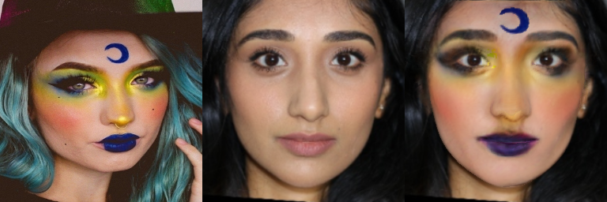

# CPM: Color-Pattern Makeup Transfer

|  | 
|:--:| 
| **CPM** (Color-Pattern Makeup Transfer) is the a holistic makeup transfer model that can **replicate both colors and patterns** from a reference makeup style to another image. |

---

This is the official implementation of the CVPR'21 paper: 

**Lipstick ain't enough: Beyond Color Matching for In-the-Wild Makeup Transfer**. \
T. Nguyen, A. Tran, M. Hoai (2021) \
IEEE Conference on Computer Vision and Pattern Recognition (CVPR).

*Although the main part of the code has been uploaded, we're still fixing some minor bugs. If you have trouble running the code, please read [Trouble Shooting](https://github.com/VinAIResearch/CPM#trouble-shooting) before [creating an issue](https://github.com/VinAIResearch/CPM/issues).* Thank you. 🌿

[](https://colab.research.google.com/drive/1K9QVSHPJ8fx9X8yg6KnhE40PPlyW5iNp?usp=sharing) \
[](https://arxiv.org/abs/xxx.xxxx) \
[](https://thaoshibe.github.io/CPM) \

---

##### Table of Content

1. [Getting Started](#getting-started)
	- [Requirements](#requirements)
	- [Quick Start (Usage)](#usage)
1. [Datasets](#datasets)
1. [Training & Evaluation](#training-and-evaluation)
1. [Citation](#citation)

---

### Getting Started

##### Requirements

- python=3.7
- torch==1.6.0
- tensorflow-gpu==1.14
- [segmentation_models_pytorch](https://github.com/qubvel/segmentation_models.pytorch)

##### Installation

``` sh
# clone the repo
git clone https://github.com/VinAIResearch/CPM.git
cd CPM

# install dependencies
conda env create -f environment.yml
```

##### Download pre-trained models

- Download Makeup pretrained models from [Drive](https://drive.google.com/drive/folders/1dagiuultGgDd_QNikMTrNlmCmWEaFV_N?usp=sharing). They are `pattern.pth` and `color.pth`. Put them in `checkpoints` folder.

- Download [PRNet pretrained model] from [Drive](https://drive.google.com/file/d/1UoE-XuW1SDLUjZmJPkIZ1MLxvQFgmTFH/view). Put it in `PRNet/net-data`

##### Usage

```sh
# Color+Pattern: 
CUDA_VISIBLE_DEVICES=0 python main.py --style ./imgs/style-1.png --input ./imgs/non-makeup.png

# Color Only: 
CUDA_VISIBLE_DEVICES=0 python main.py --style ./imgs/style-1.png --input ./imgs/non-makeup.png --color_only

# Pattern Only: 
CUDA_VISIBLE_DEVICES=0 python main.py --style ./imgs/style-1.png --input ./imgs/non-makeup.png --pattern_only
```

Result image will be saved in `result.png`

<div style="align: left; text-align:center;">
  
  <div class="caption">From left to right: Style, Input & Output</div>
</div>

---

### Datasets

We introduce ✨ 4 new datasets: CPM-Real, CPM-Synt-1, CPM-Synt-2, and Stickers datasets. Besides, we also use published [LADN's Dataset](https://georgegu1997.github.io/LADN-project-page/) & [Makeup Transfer Dataset](http://liusi-group.com/projects/BeautyGAN).

CPM-Real and Stickers are crawled from Google Image Search, while CPM-Synt-1 & 2 are build on [Makeup Transfer](http://liusi-group.com/projects/BeautyGAN) and Stickers.

|    Name  						  | #imgs | Description						   | - 									|
|:-------------------------------:|:-----:|:-----------------------------------|:----------------------------------:|
|[CPM-Real]()| 3895  | real - makeup styles 			   ||
|[CPM-Synt-1]()| 5555| synthesis - makeup img with pattern segmentation mask||
|[CPM-Synt-2]()| 1625| synthesis - triplets: makeup, non-makeup, ground-truth||
|[Stickers]()|577| high-quality images with alpha channel, used to create CPM-Synt-1 and CPM-Synt-2 ||

**Link will be provided soon**

---

### Training and Evaluation


As stated in the paper, the Color Branch and Pattern Branch are totally independent. Yet, they shared the same workflow:

1. Data preparation: Use [PRNet](https://github.com/YadiraF/PRNet) to generate texture_map of faces.
1. Training

Please redirect to [***Color Branch***](./Color) or [***Pattern Branch***](./Pattern) for further details.


### Trouble Shooting

1. [Solved] `ImportError: libGL.so.1: cannot open shared object file: No such file or directory`:
	```
	sudo apt update
	sudo apt install libgl1-mesa-glx
	```
1. [Solved] `RuntimeError: Expected tensor for argument #1 'input' to have the same device as tensor for argument #2 'weight'; but device 1 does not equal 0 (while checking arguments for cudnn_convolution)`
	Add CUDA VISIBLE DEVICES before .py. Ex: `CUDA_VISIBLE_DEVICES=0 python main.py`

### Citation

If you use this code or incorporate it into other software, please consider citing:

**Lipstick ain't enough: Beyond Color Matching for In-the-Wild Makeup Transfer**. \
T. Nguyen, A. Tran, M. Hoai (2021) \
IEEE Conference on Computer Vision and Pattern Recognition (CVPR).


```
@inproceedings{m_Nguyen-etal-CVPR21,
  author = {Thao Nguyen and Anh Tran and Minh Hoai},
  title = {Lipstick ain't enough: Beyond Color Matching for In-the-Wild Makeup Transfer},
  year = {2021},
  booktitle = {Proceedings of the {IEEE} Conference on Computer Vision and Pattern Recognition (CVPR)}
}
```
