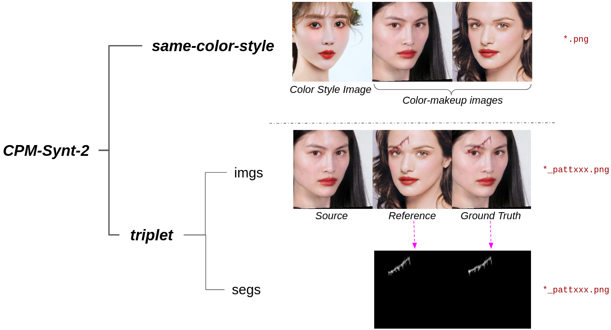

### README - About datasets

---

> ***By downloading these dataset, USER agrees:***
> 
> * to use the dataset for research or educational purposes only
> * to not distribute or part of the dataset in any original or modified form.
> * and to [cite our paper](https://github.com/VinAIResearch/CPM) whenever the dataset is employed to help produce published results.

Detail about ✨ 4 new datasets: CPM-Real, CPM-Synt-1, CPM-Synt-2, and Stickers datasets can be found in [our paper](https://arxiv.org/abs/2104.01867).

- [Stickers](#Stickers). [click to download](https://public.vinai.io/CPM-datasets/Stickers.zip)
- [CPM-Real](#CPM-Real) - Real faces with In-the-Wild makeup styles. [click to download](https://public.vinai.io/CPM-datasets/CPM-Real.zip)
- [CPM-Synt-1](#CPM-Synt-1) - Added Pattern Dataset, used to train Pattern Branch. [click to download](https://public.vinai.io/CPM-datasets/CPM-Synt-1.zip)
- [CPM-Synt-2](#CPM-Synt-2) - Transferred Pattern Dataset (Triplet), used for ground-truth experiments. [click to download](https://public.vinai.io/CPM-datasets/CPM-Synt-2.zip)

### Stickers

577 **RGBA** images. Multiple size.

```
Stickers
│0.png
│1.png
│...
│577.png
```

### CPM-Real

**CPM-Real: In-the-Wild Makeup Dataset**: 3895 RGB images. Wide range of makeup styles, ages, head poses, etc. Multiple size.

```
CPM-Real
│0.png
│1.png
│...
│3898.png
```

### CPM-Synt-1

**CPM-Synt-1: Transferred Pattern Dataset**: 5555 RGB texture images, used to train [Pattern-Branch](https://github.com/VinAIResearch/CPM/tree/main/Pattern). Split into Train/ Test set. Size: 256x256.

```
CPM-Synt-1
└───train
	└───img
		│{name1}.png
		|...
	└───seg
		│{name1}.png
		│...
└───test
	└───img
		│{name1}.png
		|...
	└───seg
		│{name1}.png
		│...
└───txt
	│test_face.txt
	│test_stick.txt
	│train_face.txt
	│train_stick.txt
```

### CPM-Synt-2

**CPM-Synt-2: Transferred Pattern Dataset**: 1625 RGB triplets (Source | Reference | Ground Truth). Size: 256x768.

We also provide 1115 `same-color-style triplet`.


```
CPM-Synt-2
└───same-color-style
		│{name1}.png
		|...
└───triplet
	└───imgs
		│{name1}_with_pattxxx.png
		|...
	└───segs
		│{name1}_with_pattxxx.png
		│...
```



